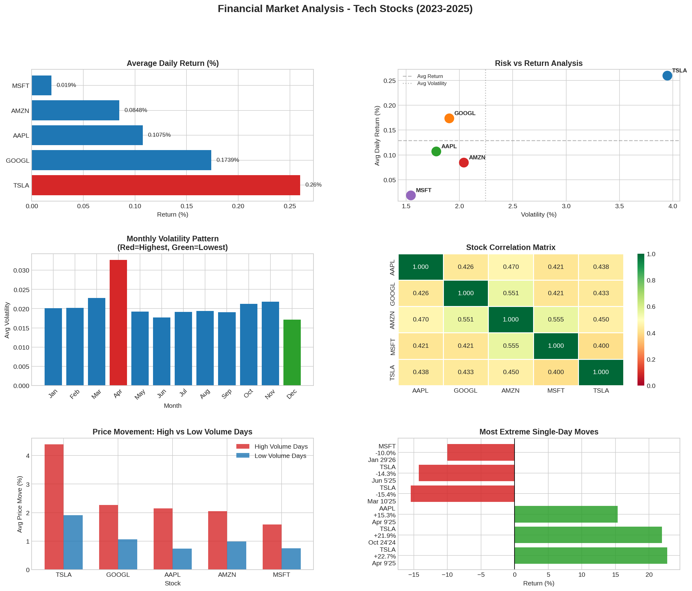

# Financial Market Analysis — SQL + Python
### Tech Stock Performance Analysis using PostgreSQL, Python & Yahoo Finance API


---

## Project Overview

A full-cycle financial data analytics project that pulls 2 years of
stock market data for 5 major tech companies using the Yahoo Finance
API, stores it in a cloud PostgreSQL database (Supabase), and answers
5 real business questions using advanced SQL queries. Results are
visualized in a 6-panel dashboard.

**Dataset:** 2,500 records | 5 stocks | 2 years | 3 relational tables

---

## Stocks Analyzed

| Ticker | Company | Sector |
|--------|---------|--------|
| AAPL | Apple Inc. | Technology |
| GOOGL | Alphabet Inc. | Technology |
| MSFT | Microsoft Corporation | Technology |
| AMZN | Amazon.com Inc. | Consumer Cyclical |
| TSLA | Tesla Inc. | Consumer Cyclical |

---

## Business Questions Answered

### Q1 - Which stock had the highest average daily return?
**Finding:** Tesla leads with 0.26% avg daily return but highest
volatility (3.95%). Alphabet has the best Sharpe ratio (0.091) -
most return per unit of risk. Microsoft is safest but lowest
returning (0.019% daily).

### Q2 - Which months are historically most volatile?
**Finding:** April is most volatile (0.0327) - tax season and
earnings season converge. December is least volatile (0.0171).
February delivers highest avg monthly return (0.1546%).

### Q3 - What are the most extreme single-day moves?
**Finding:** Tesla dominates both best (+22.69% on Apr 9, 2025)
and worst (-15.43% on Mar 10, 2025) days. April 9, 2025 was a
market-wide recovery day. Apple shows asymmetric volatility -
appears in best days but NOT worst days top 10.

### Q4 - How correlated are these stocks?
**Finding:** All pairs positively correlated (0.40-0.56) due to
systematic market risk. AMZN-MSFT (0.555) and AMZN-GOOGL (0.551)
highest - both cloud computing peers. No pair below 0.40.

### Q5 - Does high volume predict bigger price moves?
**Finding:** Yes - high volume days produce 2-3x larger price moves
across all stocks. Apple shows the strongest ratio (2.9x). Tesla
moves 4.39% on high volume days vs 1.91% on low volume days.
Volume is a reliable early warning indicator for volatility.

---

## Dashboard



---

## Database Schema

```sql
stock_prices     -- 2,500 rows: daily OHLCV + daily returns
company_info     -- 5 rows: company metadata
monthly_summary  -- 125 rows: aggregated monthly metrics
```

---

## Technical Approach

### Data Pipeline
1. Pull stock data via Yahoo Finance API (yfinance)
2. Calculate daily returns using pct_change()
3. Load into PostgreSQL via SQLAlchemy
4. Build monthly summary table using SQL window aggregations
5. Run 5 business queries using JOINs, CORR(), STDDEV(), CASE WHEN
6. Visualize with matplotlib and seaborn

### Key SQL Techniques Used
- CORR() for correlation analysis
- STDDEV() for volatility calculation
- CASE WHEN for conditional aggregation
- Window-style aggregations with GROUP BY
- CAST(... AS NUMERIC) for PostgreSQL type handling
- NULLIF() to prevent division by zero in Sharpe ratio
- Multi-table JOINs across 3 tables

---

## Tech Stack

| Tool | Purpose |
|------|---------|
| Python 3.10 | Core language |
| yfinance | Yahoo Finance API data pull |
| SQLAlchemy | Database ORM and connection |
| PostgreSQL (Supabase) | Cloud database |
| pandas | Data manipulation |
| matplotlib / seaborn | Visualization |
| Google Colab | Development environment |

---

## Project Structure

```
financial-sql-analysis/
├── financial_analysis.ipynb   - Full analysis notebook
├── financial_analysis.png     - 6-panel visualization dashboard
├── requirements.txt           - Python dependencies
└── sql/
    ├── create_tables.sql      - Database schema
    └── analysis_queries.sql   - All 5 business queries
```

---

## Author

**Suranjana Aryal** - MSBA, Saint Mary's College of California

[LinkedIn](https://www.linkedin.com/in/suranjana-aryal) |
[GitHub](https://github.com/SuruCodes68)